# Alert Analysis Flow - Complete Documentation

**Feature:** 02-detail-panel-backend  
**Date:** 2025-12-12  
**Purpose:** Document the complete analysis/calculation flow that processes the 4 artifacts (Code, Explanation, Metadata, Summary) to produce alert analysis output. **This is the MAIN PROCESS for which the app was created.**

---

## Overview

The analysis flow processes 4 input artifacts through a series of steps, with conditional LLM involvement. The system defaults to using LLM when available, but gracefully falls back to rule-based methods when LLM is unavailable.

### Decision Logic

The system checks at runtime: `if self.use_llm and self.llm_classifier:`  
- **If TRUE:** Uses LLM-powered analysis (Steps 1-4)  
- **If FALSE:** Uses fallback methods (pattern matching, basic extraction, fixed scores, templates)

---

## Flow Diagram 1: Decision Flow (Complete)

This diagram shows the complete flow with all decision points, indicating when LLM is used vs when fallbacks are used.

```mermaid
flowchart TD
    Start[Start Analysis] --> ReadArtifacts[Read 4 Artifacts<br/>🔧 NON-LLM: File Parsing]
    
    ReadArtifacts --> ReadExplanation[1. Read Explanation File<br/>🔧 NON-LLM: PDF/DOCX/HTML Parser]
    ReadArtifacts --> ReadMetadata[2. Read Metadata File<br/>🔧 NON-LLM: Excel Parser + Regex]
    ReadArtifacts --> ReadCode[3. Read Code File<br/>🔧 NON-LLM: Text Parser]
    ReadArtifacts --> ReadSummary[4. Read Summary File<br/>🔧 NON-LLM: Excel Parser + Column Detection]
    
    ReadExplanation --> ExtractBusinessPurpose[Extract Business Purpose<br/>🔧 NON-LLM: Text Extraction]
    ReadMetadata --> ExtractParameters[Extract Parameters<br/>🔧 NON-LLM: Regex Pattern Matching]
    ReadCode --> ExtractDetectionLogic[Extract Detection Logic<br/>🔧 NON-LLM: Code Comment Parsing]
    ReadSummary --> ExtractQuantitativeData[Extract Quantitative Data<br/>🔧 NON-LLM: Excel Aggregations]
    
    ExtractBusinessPurpose --> BuildContext[Build Context Understanding<br/>🔧 NON-LLM: Data Structuring]
    ExtractParameters --> BuildContext
    ExtractDetectionLogic --> BuildContext
    
    BuildContext --> ClassifyFocusArea{Step 1: Classify Focus Area<br/>🤖 LLM OR 🔧 Pattern Matching}
    
    ClassifyFocusArea -->|LLM Enabled| LLMClassify[LLM Classification<br/>🤖 LLM: Context Analysis<br/>Uses: Explanation + Code + Metadata]
    ClassifyFocusArea -->|LLM Disabled| PatternClassify[Pattern Matching<br/>🔧 NON-LLM: Weighted Keywords]
    
    LLMClassify --> AnalyzeSummary{Step 2: Analyze Summary Data<br/>🤖 LLM OR 🔧 Basic Extraction}
    PatternClassify --> AnalyzeSummary
    
    AnalyzeSummary -->|LLM Enabled| LLMAnalyze[LLM Summary Analysis<br/>🤖 LLM: Extract Key Metrics<br/>Uses: Summary Data + Context]
    AnalyzeSummary -->|LLM Disabled| BasicExtract[Basic Extraction<br/>🔧 NON-LLM: Max Values Only]
    
    LLMAnalyze --> CalculateRisk{Step 3: Calculate Risk Score<br/>🤖 LLM OR 🔧 Severity-Based}
    BasicExtract --> CalculateRisk
    
    CalculateRisk -->|LLM Enabled| LLMRisk[LLM Risk Calculation<br/>🤖 LLM: Contextual Reasoning<br/>Uses: All Analysis Results]
    CalculateRisk -->|LLM Disabled| SeverityRisk[Severity-Based Risk<br/>🔧 NON-LLM: Fixed Scores<br/>Critical:90 High:75 Medium:60 Low:50]
    
    LLMRisk --> GenerateDescription{Step 4: Generate Description<br/>🤖 LLM OR 🔧 Template}
    SeverityRisk --> GenerateDescription
    
    GenerateDescription -->|LLM Enabled| LLMDesc[LLM Description<br/>🤖 LLM: Human-Readable Narrative<br/>Uses: All Analysis Results]
    GenerateDescription -->|LLM Disabled| TemplateDesc[Template Description<br/>🔧 NON-LLM: Fixed Format]
    
    LLMDesc --> CalculateScore[Step 5: Calculate Combined Score<br/>🔧 NON-LLM: ScoringEngine<br/>Mathematical Formula]
    TemplateDesc --> CalculateScore
    
    CalculateScore --> CreateContentFinding[Create ContentFinding Object<br/>🔧 NON-LLM: Data Assembly]
    CreateContentFinding --> PopulateDatabase[Populate Database Tables<br/>🔧 NON-LLM: Data Transformation]
    
    PopulateDatabase --> CreateAlertInstance[Create AlertInstance<br/>🔧 NON-LLM: Direct Mapping]
    PopulateDatabase --> CreateAlertAnalysis[Create AlertAnalysis<br/>🔧 NON-LLM: Direct Mapping]
    PopulateDatabase --> CreateCriticalDiscoveries[Create CriticalDiscovery<br/>🔧 NON-LLM: Extract from notable_items]
    PopulateDatabase --> CreateKeyFindings[Create KeyFinding<br/>🔧 NON-LLM: Extract from analysis]
    PopulateDatabase --> CreateConcentrationMetrics[Create ConcentrationMetric<br/>🔧 NON-LLM: Extract from analysis]
    
    CreateCriticalDiscoveries --> End[Analysis Complete]
    CreateKeyFindings --> End
    CreateConcentrationMetrics --> End
```



**SVG Export:** [`analysis_flow_diagram.svg`](analysis_flow_diagram.svg)

---

## Flow Diagram 2: LLM Path (When LLM is Available)

This diagram shows the complete flow when LLM is available and enabled.


**SVG Export:** [`analysis_flow_with_llm.svg`](analysis_flow_with_llm.svg)

---

## Flow Diagram 3: Fallback Path (When LLM is NOT Available)

This diagram shows the complete flow when LLM is unavailable or disabled.

```mermaid
flowchart TD
    Start[Start Analysis] --> ReadArtifacts[Read 4 Artifacts<br/>🔧 NON-LLM: File Parsing]
    
    ReadArtifacts --> ReadExplanation[1. Read Explanation File<br/>🔧 NON-LLM: PDF/DOCX/HTML Parser]
    ReadArtifacts --> ReadMetadata[2. Read Metadata File<br/>🔧 NON-LLM: Excel Parser + Regex]
    ReadArtifacts --> ReadCode[3. Read Code File<br/>🔧 NON-LLM: Text Parser]
    ReadArtifacts --> ReadSummary[4. Read Summary File<br/>🔧 NON-LLM: Excel Parser + Column Detection]
    
    ReadExplanation --> ExtractBusinessPurpose[Extract Business Purpose<br/>🔧 NON-LLM: Text Extraction]
    ReadMetadata --> ExtractParameters[Extract Parameters<br/>🔧 NON-LLM: Regex Pattern Matching]
    ReadCode --> ExtractDetectionLogic[Extract Detection Logic<br/>🔧 NON-LLM: Code Comment Parsing]
    ReadSummary --> ExtractQuantitativeData[Extract Quantitative Data<br/>🔧 NON-LLM: Excel Aggregations]
    
    ExtractBusinessPurpose --> BuildContext[Build Context Understanding<br/>🔧 NON-LLM: Data Structuring]
    ExtractParameters --> BuildContext
    ExtractDetectionLogic --> BuildContext
    
    BuildContext --> CheckLLM{LLM Available?<br/>use_llm=False<br/>OR<br/>llm_classifier=None}
    
    CheckLLM -->|NO LLM| PatternClassify[Step 1: Pattern Matching<br/>🔧 NON-LLM: Weighted Keywords<br/>Fallback Classification]
    
    PatternClassify --> BasicExtract[Step 2: Basic Extraction<br/>🔧 NON-LLM: Max Values Only<br/>Fallback Analysis]
    
    BasicExtract --> SeverityRisk[Step 3: Severity-Based Risk<br/>🔧 NON-LLM: Fixed Scores<br/>Critical:90 High:75 Medium:60 Low:50]
    
    SeverityRisk --> TemplateDesc[Step 4: Template Description<br/>🔧 NON-LLM: Fixed Format<br/>Fallback Description]
    
    TemplateDesc --> CalculateScore[Step 5: Calculate Combined Score<br/>🔧 NON-LLM: ScoringEngine<br/>Mathematical Formula]
    
    CalculateScore --> CreateContentFinding[Create ContentFinding Object<br/>🔧 NON-LLM: Data Assembly]
    CreateContentFinding --> PopulateDatabase[Populate Database Tables<br/>🔧 NON-LLM: Data Transformation]
    
    PopulateDatabase --> CreateAlertInstance[Create AlertInstance<br/>🔧 NON-LLM: Direct Mapping]
    PopulateDatabase --> CreateAlertAnalysis[Create AlertAnalysis<br/>🔧 NON-LLM: Direct Mapping]
    PopulateDatabase --> CreateCriticalDiscoveries[Create CriticalDiscovery<br/>🔧 NON-LLM: Extract from notable_items]
    PopulateDatabase --> CreateKeyFindings[Create KeyFinding<br/>🔧 NON-LLM: Extract from analysis]
    PopulateDatabase --> CreateConcentrationMetrics[Create ConcentrationMetric<br/>🔧 NON-LLM: Extract from analysis]
    
    CreateCriticalDiscoveries --> End[Analysis Complete]
    CreateKeyFindings --> End
    CreateConcentrationMetrics --> End
```



**SVG Export:** [`analysis_flow_without_llm.svg`](analysis_flow_without_llm.svg)

---

## Decision Logic Details

### When LLM Path is Used

**Condition:** `use_llm=True` AND `llm_classifier` is not None

**Code Reference:** [`backend/app/services/content_analyzer/analyzer.py`](backend/app/services/content_analyzer/analyzer.py) lines 161-193

**Decision Check:**
```python
if self.use_llm and self.llm_classifier:
    # Use LLM path 🤖
else:
    # Use fallback path 🔧
```

**How `use_llm` is Determined:**

1. **Default:** `use_llm=True` (line 104)
2. **Automatic Detection:** If no API key found → `use_llm=False` (lines 500-503)
3. **API Override:** Can be set per-request via API parameters (lines 316-320)

### When Fallback Path is Used

**Condition:** `use_llm=False` OR `llm_classifier` is None

**Fallback Methods:**

1. **Step 1:** Pattern matching with weighted keywords (`_fallback_classification`)
2. **Step 2:** Basic extraction of max values only (`_fallback_analysis`)
3. **Step 3:** Fixed severity-based scores (`_fallback_risk_score`)
4. **Step 4:** Template-based description (`_fallback_description`)

---

## Phase Breakdown

### Phase 1: Artifact Reading (Always NON-LLM)

**Code:** [`backend/app/services/content_analyzer/artifact_reader.py`](backend/app/services/content_analyzer/artifact_reader.py)

- **Explanation File:** PDF/DOCX/HTML parser
- **Metadata File:** Excel parser + regex parameter extraction
- **Code File:** Text file reader + comment extractor
- **Summary File:** Excel parser + dynamic column detection + aggregations

### Phase 2: Analysis Pipeline (LLM OR Fallback)

**Code:** [`backend/app/services/content_analyzer/analyzer.py`](backend/app/services/content_analyzer/analyzer.py) - `analyze_alert()` method

**LLM Steps (when available):**
- Step 1: `llm_classifier.classify_focus_area(artifacts)`
- Step 2: `llm_classifier.analyze_summary(artifacts, focus_area)`
- Step 3: `llm_classifier.calculate_risk_score(artifacts, focus_area, analysis)`
- Step 4: `llm_classifier.generate_finding_description(artifacts, focus_area, analysis)`

**Fallback Steps (when LLM unavailable):**
- Step 1: `_fallback_classification(artifacts)`
- Step 2: `_fallback_analysis(artifacts)`
- Step 3: `_fallback_risk_score(analysis)`
- Step 4: `_fallback_description(artifacts, analysis)`

### Phase 3: Scoring (Always NON-LLM)

**Code:** [`backend/app/services/content_analyzer/scoring_engine.py`](backend/app/services/content_analyzer/scoring_engine.py)

- Always rule-based mathematical formulas
- Base score from severity (90/75/60/50)
- Adjustments for quantitative factors (+/- 20)
- Focus area multipliers (+/- 15)
- BACKDAYS normalization (if present)

### Phase 4: Database Population (Always NON-LLM)

**Code:** [`backend/app/api/content_analysis.py`](backend/app/api/content_analysis.py) - `_populate_dashboard_tables()` (lines 481-697)

- Direct data mapping and transformation
- Creates AlertInstance, AlertAnalysis, CriticalDiscovery, KeyFinding, ConcentrationMetric records
- No AI involved - pure data transformation

---

## Key Insights

1. **LLM is Optional:** The system can run entirely without LLM using fallback methods
2. **LLM Enhances Quality:** When available, LLM provides contextual understanding vs basic pattern matching
3. **Core Calculations are Non-LLM:** Financial impact, risk scores, aggregations are always rule-based
4. **Hybrid Approach:** LLM provides insights, ScoringEngine provides final calculations
5. **Database is Always Procedural:** No AI involved in data storage - pure transformation
6. **Default Behavior:** System defaults to using LLM when API key is available

---

## Code References

- **Main Orchestrator:** [`backend/app/services/content_analyzer/analyzer.py`](backend/app/services/content_analyzer/analyzer.py)
- **Artifact Reading:** [`backend/app/services/content_analyzer/artifact_reader.py`](backend/app/services/content_analyzer/artifact_reader.py)
- **LLM Classification:** [`backend/app/services/content_analyzer/llm_classifier.py`](backend/app/services/content_analyzer/llm_classifier.py)
- **Scoring Engine:** [`backend/app/services/content_analyzer/scoring_engine.py`](backend/app/services/content_analyzer/scoring_engine.py)
- **Database Population:** [`backend/app/api/content_analysis.py`](backend/app/api/content_analysis.py) - `_populate_dashboard_tables()`

---

## Related Documentation

- [SPEC.md](SPEC.md) - Endpoint specification
- [ANALYSIS.md](ANALYSIS.md) - Current state analysis
- [CODE.md](CODE.md) - Code references and implementation details

